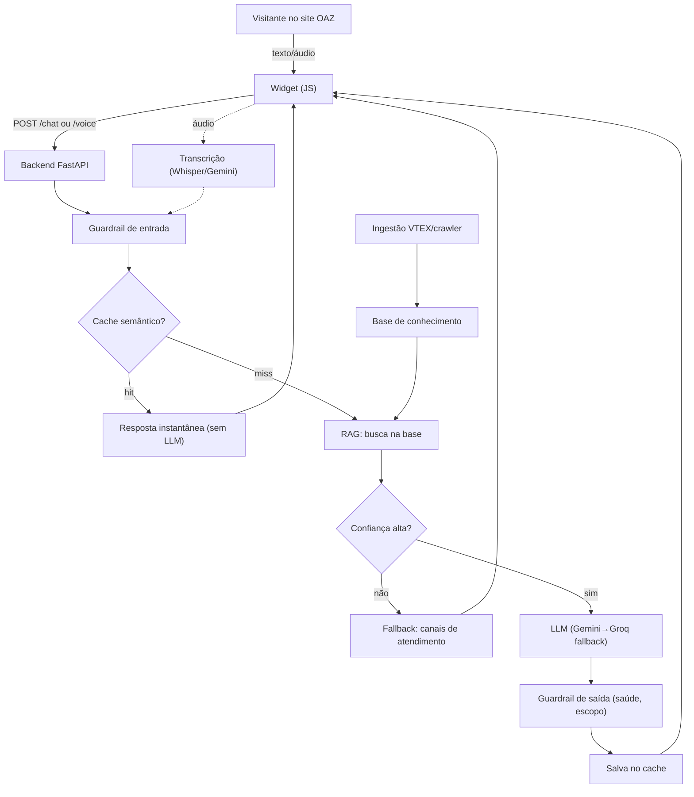

# 01 · Arquitetura

## Visão geral

O Agente OAZ tem **3 partes independentes**:

1. **Widget** (`/widget`): JavaScript embutível no site (loja VTEX). Mostra o
   logo no canto inferior direito, o balão "Posso te ajudar?" e o painel de
   chat lateral. Captura texto e áudio.
2. **Backend** (`/backend`): API FastAPI que faz RAG + guardrails + cache e
   chama o LLM (Gemini/Groq). Transcreve áudio.
3. **Ingestão** (`/ingestion`): scripts que transformam o conteúdo do site
   (catálogo VTEX + páginas) na base de conhecimento consultada pelo RAG.

## Fluxo de uma pergunta

1. Usuário digita ou fala. Áudio → `/transcribe` (ou `/voice`) → texto.
2. `/chat` recebe `{message, history}`.
3. **Guardrail de entrada** bloqueia conteúdo indevido.
4. **Cache semântico**: se já houve pergunta parecida, devolve na hora.
5. **RAG**: busca os trechos mais relevantes da base OAZ.
6. Se a confiança for baixa → **encaminha para atendimento humano**.
7. Senão, monta o prompt com o contexto e chama o **LLM** (com fallback de
   provedor).
8. **Guardrail de saída**: anexa aviso de saúde quando aplicável, garante escopo.
9. Salva no cache e responde (em **texto**), com a **fonte**.

## Por que stateless

O backend não guarda sessão em memória entre requisições — o histórico vem do
widget. Isso permite subir **N cópias atrás de um load balancer** e escalar
horizontalmente. O único estado compartilhado desejável é o **cache** (em
produção, Redis/Upstash) e a **base vetorial** (Supabase).

## Decisões-chave

| Tema | Decisão | Motivo |
|---|---|---|
| Widget | Vanilla JS, sem framework | zero dependência, cola em qualquer site/VTEX |
| LLM | Gemini Flash (primary) + Groq (fallback) | grátis no início, rápido, multimodal |
| Volume | cache semântico + stateless + fallback | segura picos sem custo |
| Base | RAG (não fine-tuning) | atualiza preço/produto sem retreinar |
| Áudio | server-side (Whisper/Gemini) | qualidade; no demo usa Web Speech API |
